# Predicting Profile Kisses in a Dating App 
An Exploratory Data Analysis and Machine Learning Approach
## Abstract:
This study aims to develop a predictive model for user engagement on a dating app, quantified by the number of "profile kisses." We utilize a dataset comprising various user attributes, including demographic details, app usage metrics, and user preferences. Through extensive data cleaning, feature engineering, and selection, we create a robust dataset to train multiple machine-learning models. The models, including Random Forest, Gradient Boosting, and XGBoost, are evaluated using metrics such as Mean Squared Error (MSE) and Root Mean Squared Log Error (RMSLE).

## 1. Introduction:
This study focuses on predicting user engagement on Lovoo, measured by "profile kisses," using a dataset collected through a custom tool. To gather the data, two male profiles were created specifically for this purpose, and the tool collected only female user profiles suggested by Lovoo's recommendation algorithm. 
The dataset’s limitation—being confined to profiles recommended for these two male profiles—resulted in a repetitive set of female profiles influenced by factors like location and cookies. Future work should aim to include a broader range of profiles across different genders and age ranges. The goal is to identify the key factors influencing "profile kisses" and develop a predictive model to enhance user engagement and app effectiveness.

## 2. Domain Knowledge:
1. Defining the Questions: The primary question is: What factors influence the number of profile kisses on a dating app? Additional sub-question include identifying the most significant predictors.
Understanding the Problem: The problem involves predicting a numeric outcome (profile kisses) using various user features. We understand that "profile kisses" represent a measure of user engagement on the app, which could be influenced by multiple factors such as user profile completeness, interaction history, and app usage behavior.
2. Outcome Definition: The desired outcome is a machine learning model capable of accurately predicting the number of profile kisses, with minimal error, using a set of relevant features.

## 3. Data Preparation:
### Data Extraction:
The data was extracted from two Excel files provided by the dating app. These files contained user information such as demographic details, activity metrics, and profile descriptions.
### File Preparation: 
Data from both files were merged based on common user identifiers. The merging process involved joining on multiple keys to ensure a comprehensive dataset.
### Exploratory Data Analysis (EDA): 
An initial exploratory data analysis was conducted to identify patterns, distributions, and potential correlations between features and the target variable.

1. **Data Cleaning**: Removing duplicates and irrelevant columns.

2. **Data Imputation**: Missing values were addressed using the KNN imputer, which utilizes the nearest neighbors to estimate missing values based on similarity in feature space.

3. **Data Transformation and Engineering**: New features were engineered, such as:

      - **Flags**: Binary flags indicating the presence of emojis or mentions of Instagram.
      
      - **Other**: Consolidate categories with low counts into 'Other' to reduce cardinality      

4. **Feature Selection**: Feature selection was conducted using multiple models, including Lasso Regression, Random Forest, and Gradient Boosting, to identify the most predictive variables. 21 columns remaind.

Figure 1: Distribution Plots of Numeric Features: 
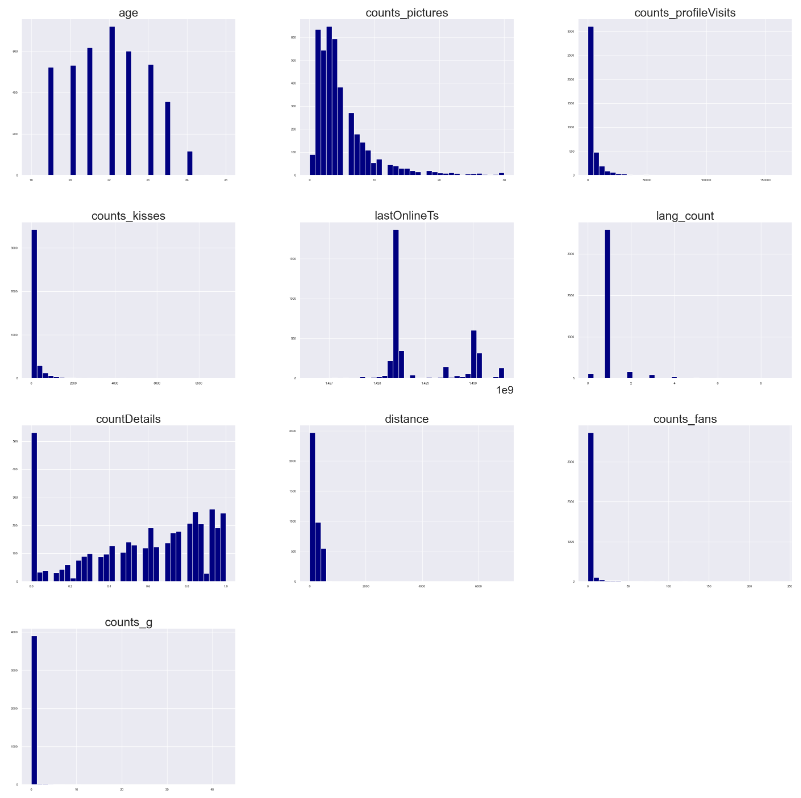

Figure 2: Box Plots of Numeric Features to identify Outliers: 
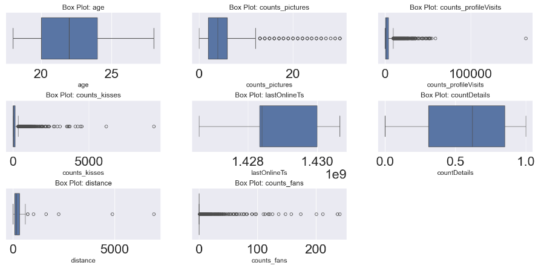

Figure 3: Features Vs Target Value: 
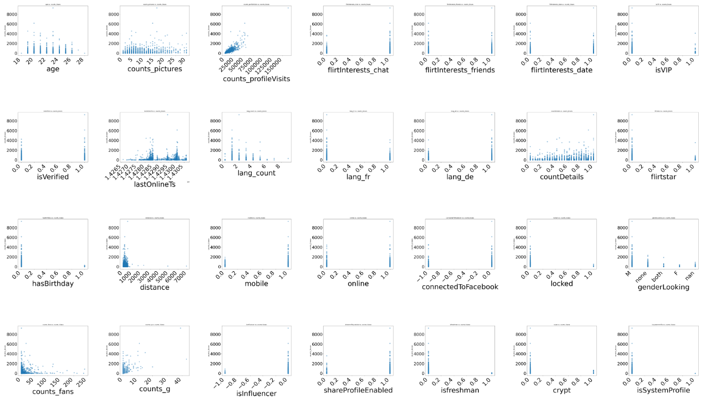

Figure 4: Corralation of Featuers and Target Value: 
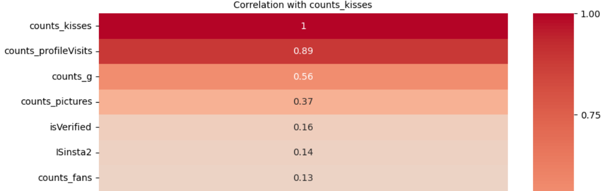

Figure 5: Correlation Matrix Heatmap: correlation matrix for all numeric features to highlight relationships and potential multicollinearity.
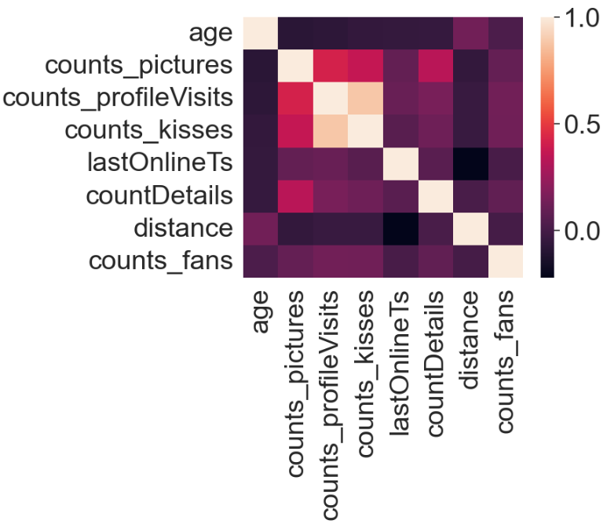

Figure 6: Word Cloud of Text Data: word cloud of “freetext” and “whazzup” columns before excluding emojis and after.
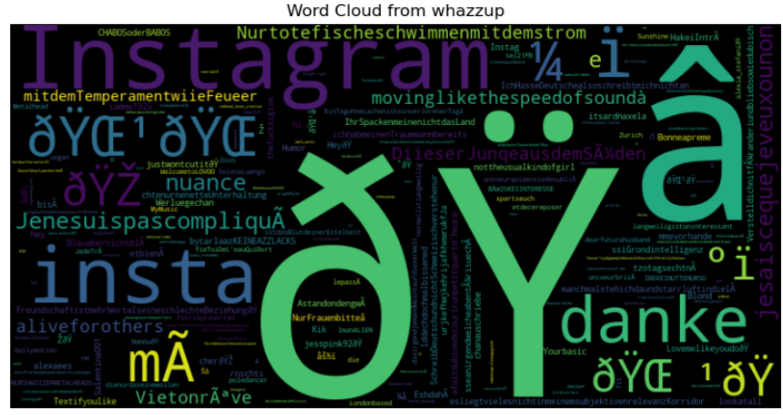
- 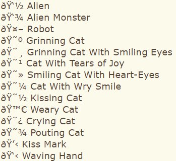
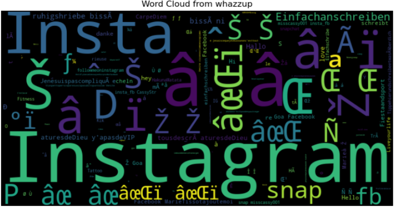

—------------------------------------------------------------------------------------------
—----------------------------------------------------
      
## 4. Algorithms:

### Method Selection: 
Supervised learning methods, specifically regression models, were selected due to the numeric nature of the target variable.
### Dataset Partitioning: 
The dataset was partitioned into training (70%), validation-dev (15%), and test (15%) sets to provide separate data for training, hyperparameter tuning, and final evaluation.
### Model Selection: 
Multiple models were trained and evaluated, including:
- Linear Regression
- Decision Tree Regressor
- Random Forest Regressor
- AdaBoost Regressor
- Gradient Boosting Regressor (GBM)
- Support Vector Regressor (SVR)
- XGBoost Regressor
### Hyperparameter Tuning: 
Grid search with cross-validation (GridSearchCV) was employed to fine-tune hyperparameters for Random Forest and XGBoost models, optimizing parameters like the number of trees, maximum depth, and learning rate.
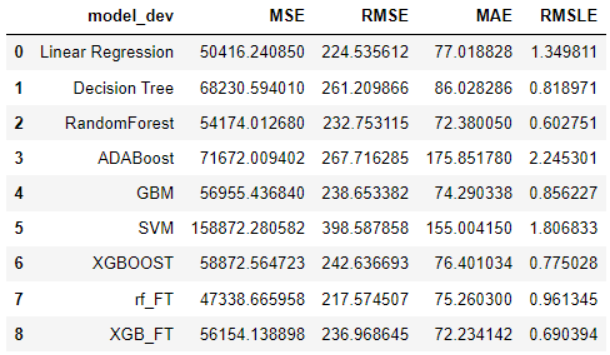

## 5. Implementation:
The Random Forest and XGBoost models were identified as top-performing based on their MSE and MAE values.
- Model Performance Metrics: performance metrics (MSE, RMSE, MAE, RMSLE) for all models on the validation and test sets.
- Testing on New Data: The models were validated on unseen test data to confirm generalizability.
  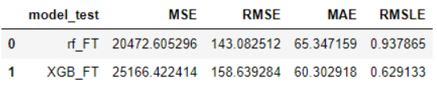
- Predicted vs. Actual Values Plot:
 Predictions were plotted against actual values to visually assess performance and ensure robustness.
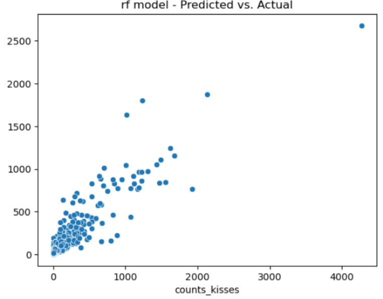

## 6. Results:
### Model Performance: 
The Random Forest Regressor achieved the lowest validation error, MSE and RMSE. The XGBoost Regressor also performed well, indicating its suitability for deployment given its balance of accuracy and interpretability.

### Conclusion:
This project attempted to develop a predictive model for user engagement in a dating app by identifying key features influencing "profile kisses." 
However, the results indicate that the models struggled to accurately predict user engagement, likely due to limitations in the dataset and its quality. Neither the Random Forest nor the XGBoost models provided satisfactory performance, suggesting that predicting user popularity using the available data is challenging.

Future Directions: Future research could focus on improving data quality, incorporating more diverse data sources, and exploring advanced modeling techniques or feature engineering strategies to enhance prediction accuracy.
# No wonder it's so hard to find your perfect match in life 
